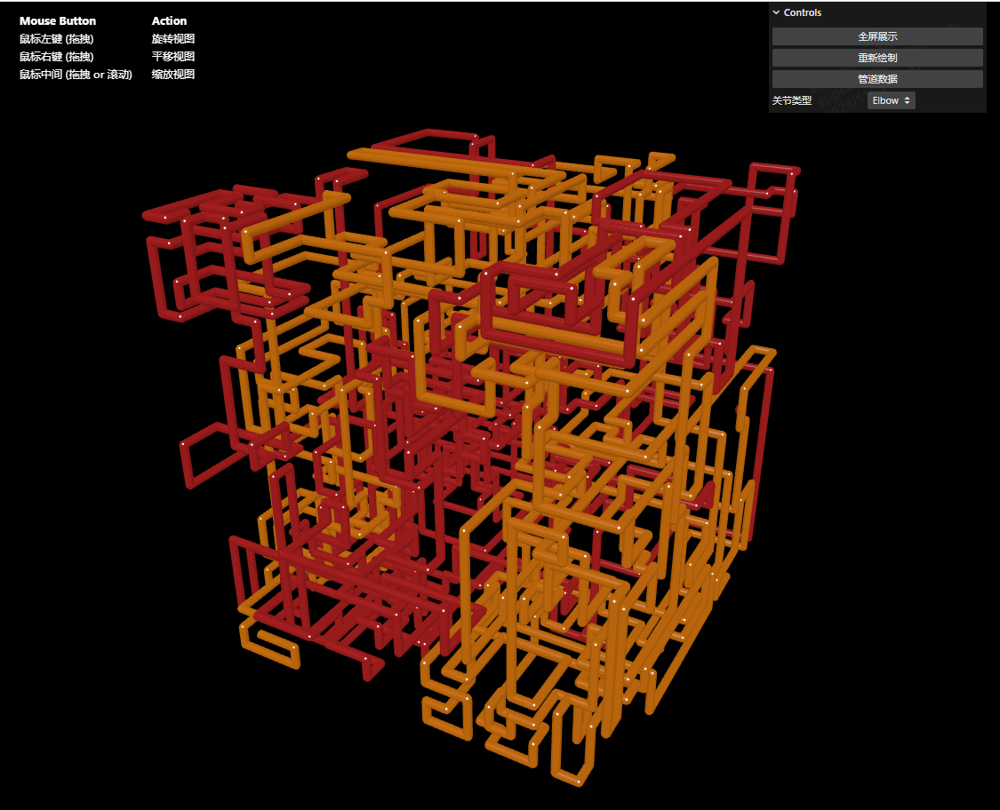

# React + TypeScript + Vite
[English](./README.md) · 中文

当前项目基于 使用了 React + TypeScript + Vite 对 [pipes](https://github.com/1j01/pipes) 进行重构，可以在指定大小的3维空间内自动生成管道路线，也可以根据指定的 JSON 文件生成管道路线。

## 运行
```bash
yarn     // 安装依赖 
yarn dev // 运行开发环境
```

## 效果图
[]()
