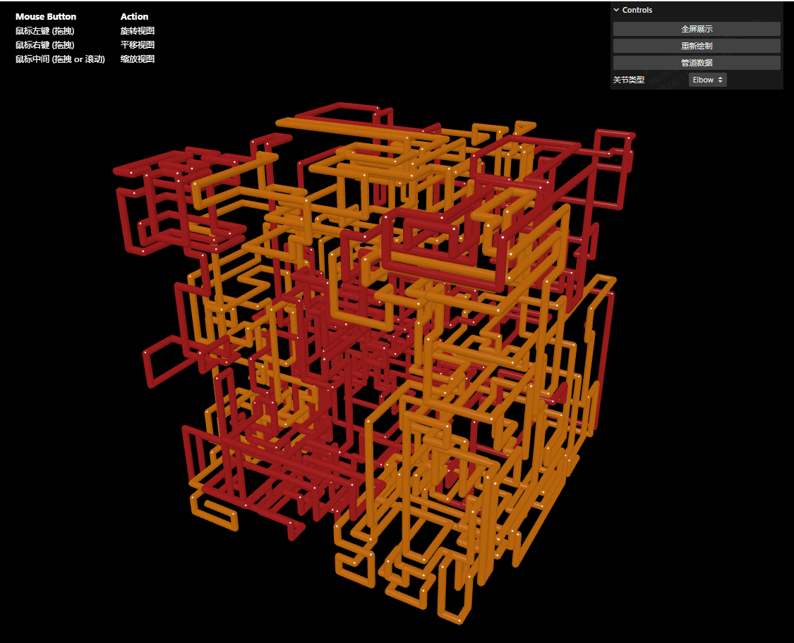

# React + TypeScript + Vite
English · [中文](./README-zh_CN.md)

This project is a refactor of [pipes](https://github.com/1j01/pipes) using React + TypeScript + Vite. It can automatically generate pipe routes in a specified 3D space and can also generate pipe routes based on a specified JSON file.

## Running
```bash
yarn     // Install dependencies
yarn dev // Run development environment
```

## Preview
[]()